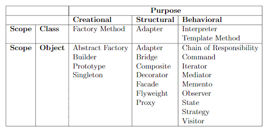
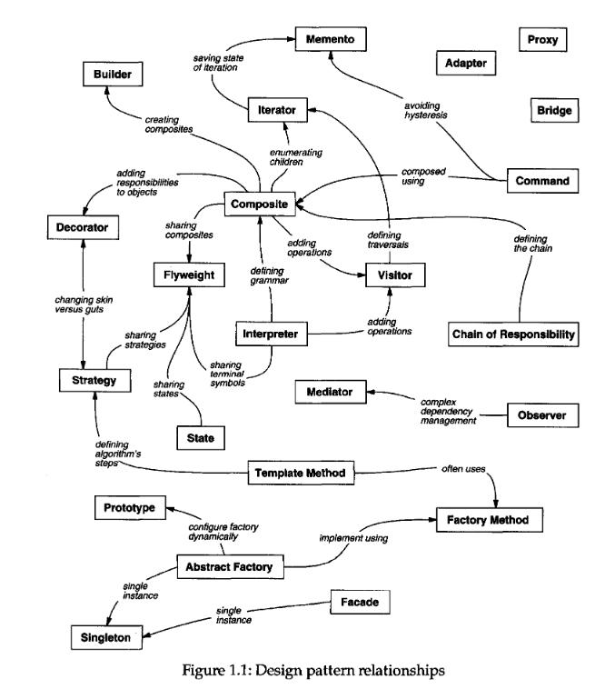
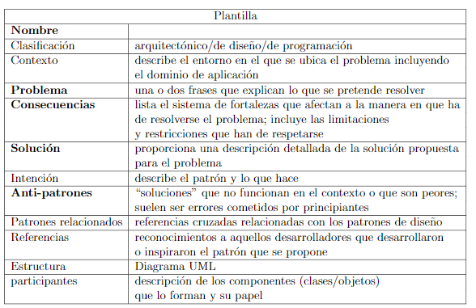
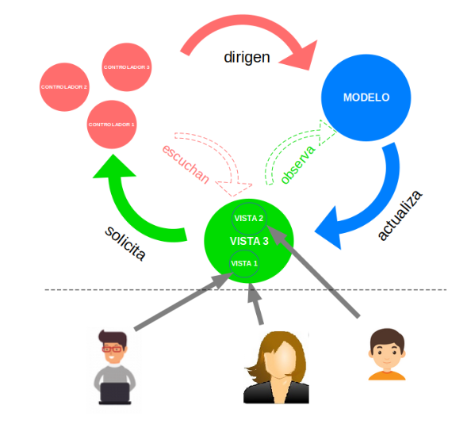
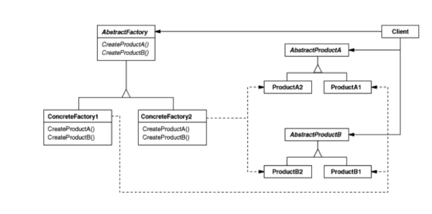
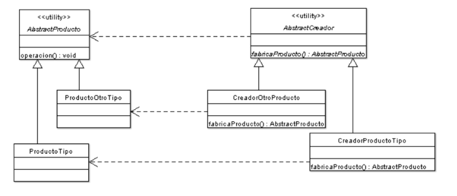
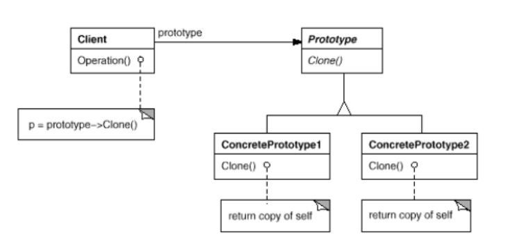

# Tema 1. Desarrollo utilizando patrones de diseño

## 1.1 Análisis y diseño basado en patrones

### 1.1.1 > Origen e historia de los patrones software
Los patrones software fueron una adaptación al mundo de las TIC de los *patrones arquitectónicos*.

Según Christopher Alexander, un patrón arquitectónico se define como "la identificación de ideas de diseño arquitectónico mediante descripciones arquetípicas y reusables". 

Teorías como esta, basadas en la naturaleza del diseño, repercutieron en otros campos como la sociología o el software, adaptándolos a su terreno.

Estas ideas fueron presentadas en el ámbito del software por Beck y Cunningham en 1987 en un congreso, y 7 años más tarde se hizo el primer libro sobre el tema, en 1994, por Erich Gamma, Richard Helm, Ralph Johnson y John Vlissides, titulado `Gang of Four (GoF)`, definiendo el concepto de patrón software a partir del patrón arquitectónico:

> "Cada patrón describe un problema que ocurre una y otra vez en nuestro entorno, y luego describe el núcleo de la solución a nuestro problema de manera que puedas aplicar esa solución millones de veces sin tener que hacerlo de la misma manera 2 veces" ~ `Brad Appleton`

En resumidas palabras, "no reinventemos la rueda".

Antes de ello se hizo un "retiro espiritual" en las montañas donde fueron expertos en desarrollo de software para intentar integrar las ideas de los patrones software y los objetos software, logrando con ello otro libro de patrones de más alto nivel en 1996.

### 1.1.2 > Conceptos y clasificación
**Patrón software**: "Un patrón implica una descripción general de una solución recurrente a un problema recurrente con varios objetivos y restricciones. Pero no solo identifica una solución, ¡sino que también explica por qué se necesita una solución!" ~ `Brad Appleton`

Los patrones surgen desde la orientaci ́on a objetos y resuelven problemas a nivel de diseño orientado a objetos. Pero se puede aplicar a cualquier paradigma de programación, aportando soluciones en un espectro mucho más amplio en el nivel de abstracción, bien de forma muy genérica, o bien dentro del código a través de expresiones lingüísticas.

> Así, podemos clasificar los patrones de esta primera forma, según la abstracción:
>- *Patrones arquitectónicos*: Un patrón arquitectónico expresa una organización estructural o esquema para sistemas software. Provee de un conjunto de subsistemas predefinidos, especifica sus responsabilidades, e incluye reglas y guías para relacionarlos entre ellos.
>- *Patrones de diseño*: Un patrón de diseño provee un esquema para refinar los subsistemas o componentes de un sistema software, o las relaciones entre ellos. Describe comúnmente la estructura recurrente de componentes que se comunican de forma que se resuelve un problema de diseño general en un contexto particular
>- *Patrones de código, o idioms*: Es un patrón de bajo nivel específico de un lenguaje de programación. Este describe como implementar aspectos particulares de componentes o relaciones entre estos usando las características de ese lenguaje.
  
Otra clasificación los divide según la fase del ciclo de vida del desarrollo del software:

>Esta sería:
>- *Patrones conceptuales*: Aquel que se describe con términos y conceptos sobre un dominio de la aplicación
>- *Patrones de diseño*: Aquel que se define con constructos del diseño software, como los objetos, clases. herencia...
>- *Patrones de programación*: Aquel que se describe en términos de constructos del lenguaje de programación

La tercera, según el GoF, establece dos criterios:
|Propósito|Ámbito de aplicación|
|---------|--------------------|
|Refleja lo que hace un patrón|Especifica en qué ámbito se aplica el patrón|
| 3 tipos| 2 tipos|
|- Creacional: Relacionados con cómo se crean los objetos|- De clase: El patrón se aplica principalmente a clases. |
|- Estructural: Relacionados con los componentes que forman las clases y los objetos |- De objeto: El patrón se aplica principalmente a objetos. |
|- De comportamiento: Relacionados con la formaen la que los objetos y las clases interactúan entre sí y cómo se reparten las responsabilidades ||

 

Así, los patrones se verían así:

 

La última clasificación es cómo los patrones son comprendidos, que se puede ver en este grafo:

### 1.1.3 > ¿Esto no se parece un poco a los *frameworks*?
Parece que hay una relación entre ellos, pero no son lo mismo, no nos confundamos:

**Marco de trabajo / Framework**: Es un conjunto de funcionalidad software YA IMPLEMENTADA útil en un dominio de aplicaciones específico, como un Sistema Gestor de Bases de Datos.

**Patrón software**: Es una guía o "receta" que se puede aplicar en cualquier dominio de aplicaciones, dando la misma solución a distintos problemas con una base similar, abstrayendo la parte común de ellos para llegar a tal solución. NO ESTÁ IMPLEMENTADO. 

### 1.1.4 > Elementos de un patrón de diseño
La GoF definió 4 elementos esenciales en un patrón de diseño:
- *Nombre de patrón* : Hay que hacer que se defina el problema, la solución y las consecuencias en una palabra o dos, que se incluirán en el lenguaje del diseño. Encontrar un nombre es una parte difícil para engrosar el catálogo de patrones.
- *El problema*: Describe cuándo aplicar el patrón y el contexto donde sucede. Puede ser especificar problemas como ,por ejemplo, cómo representar algoritmos u objetos. A veces el problema incluye ciertas condiciones que deben cumplirse para que tenga sentido aplicar el patrón.
- *La solución*: Describe los elementos que confeccionan el diseño, sus relaciones, responsabilidades y colaboraciones. No debe describir un diseño o implementación en sí, sino ser usado como una descripción abstracta de como un conjunto de elementos puede solucinar el problema.
- *Las consecuencias*: Aunque no se digan de ellas, son vitales para evaluar diseños alternativos y para entender los costos y beneficios de implantarse en nuestro sistema. Estas consecuencias conciernen usualmente al espacio y tiempo, la implementación y el lenguaje a usar, y el impacto en la portabilidad, flexibilidad y extensibilidad.

En la actualidad ya se provee de la siguiente plantilla para poder describir un patrón:

### 1.1.5 > Un ejemplo práctico : Modelo-Vista-Controlador
¿Recuerdas cuándo en PDO vimos MVC? Pues resulta que es una terna que se vió en el lenguaje `SmallTalk` para construir Interfaces Gráficas de Usuario. Recordemos que la idea de hacer esto era separar el objeto o modelo de la aplicación de su representación o vista. Además, para controlar la interacción con la presentación visual y que sirva de intermediario con el modelo, entra en escena el Controlador. Con ello aumentaremos su flexibilidad y reusabilidad.

>Nótese que la terna es totalmente independiente entre ellos. Por ejemplo, una Web puede cumplirlo (Siendo HTML y CSS quien renderice la vista, y funciones JS/PHP para modificar la Base de Datos), o Java (con Swing en la Vista y un package dedicado al Modelo)

El GoF utiliza todo esto paraidentificar e introducir los primeros tres patrones de su libro: [Observer](#observer--observador) , [Composite](#composite--componedor) y [Strategy](#strategy--estrategia).
Otros patrones podrían ser el [Factory](#factorías) para especificar el Controlador; o el [Decorator](#decorator--decorador), que añade desplazamiento a una vista.

## 1.2 ¿Cómo resolvemos problemas de diseño usando patrones de diseño?

"Los patrones de diseño resuelven algunos de los problemas cotidianos que los diseñadores de sistemas orientados a objetos encaran, y de maneras distintas" ~ `Gamma, Helm, Johnson y Vlissides, Design Patterns`

El proceso se basaría en estos pasos:
1. *Encuentra los objetos apropiados*: Al usar patrones de diseño pueden aparecer clases que no forman parte de las clases extraídas del análisis, ya que viene dado a la hora de querer hacer un sistema más flexible y reutilizable.
2. *Considera distintas granularidades*: Hay objetos que representan un sistema, objetos que han de ser instanciados una sola vez o muchos objetos similares pero con poco contenido.
3. *Especifica la interfaz de un objeto*: Hay muchos patrones de diseño que se relacionan con la ligadura dinámica de la orientación a objetos y el hecho de que los objetos con una misma interfaz o parte común se pueden intercambiar.
4. *Programa en función de las interfaces, NO de las implementaciones*: Gracias a las interfaces, podemos disminuir el acoplamiento entre los subsistemas. Aunque puede que no sea necesario en lenguajes no tipados como  `Ruby`, en otros lenguajes tipados como `Java` o `C++` si permite que se pueda valer de ello para adaptarse a los tipos estáticos.

> "En todo caso, siempre podemos relacionarlos objetos no por la implementacion de los metodos sino por la interfaz (o signatura) de estos metodos. Gracias a esto, los objetos clientes de estos objetos notienen que saber nada sobre la implementacion de los metodos a los que invocan, lesbasta saber que el metodo forma parte de la interfaz del objeto.
> 
>  Incluso tampoco tiene por que conocer el tipo especıfico (tipo dinámico) de esos objetos. Los patrones creaciones tienen la funcion  de  permitir  este  desacoplamiento, con distintas propuestas para asociar una interfaz con la implementacion concreta en el momento de instanciar un objeto." ~ `Apuntes de DS`

1. *Saca el máximo partido a la reusabilidad del código* Aquí algunos tips:

   a. *Favorece la composición (caja negra) sobre la herencia (caja blanca)*: Da igual que la situación favorezca la clasificación "Es un..."; es mejor no abusar de la herencia, ya que aumenta la dependencia del código con respecto a las clases padre e hijas.

   b. *Usa la delegación como alternativa extrema a la composición que sustituya a la herencia* : Hay casos en los que es mejor delegar la responsabilidad que tiene el objeto receptor a objetos de otras clases, con tal de aumentar la reusabilidad.

   c. *Usa tipos parametrizables como alternativa a la herencia* : Las plantillas permiten reutilizar código en lenguajes tipados que permiten crear clases genéricas especificando como parámetro el tipo de los objetos que se usarán. Así, en tiempo de compilación se usará un objeto en base a esa plantilla y el tipo especificado.

## 1.3 Estudio del catálogo *GoF* de patrones de diseño 

### 1.3.1 > Patrones creacionales.
#### Factorías
Es un objeto con algún método para crear objetos. Sólo hay que preocuparse de que se diga qué se quiere, sin importar el tipo específico. Este concepto se concreta sin embrago de forma distinta según el tipo de lenguaje orientado a objetos:
- En lenguajes **OO puros como Ruby o Smalltalk, donde todo se considera un objeto, esta definición contempla por tanto a la mas simple de las factorías, la que crea una instancia de la propia clase, pues es un método más
- En lenguajes **OO híbridos** como Java o C++, las  factorıas  no pueden considerarse generalizaciones de los llamados “constructores”, pues estos son metodos especiales que, ademÁs de seguir reglas sintácticas diferentes al resto de los métodos,no permiten polimorfismo, debiéndose explicitar la clase concreta que se quiere crear.
  
#### Factoría abstracta  
Es un patrón basado en factorías recomendado cuando en una aplicación tenemos líneas, temáticas o familias paralelas de clases y se prevé que se puedan añadir más líneas con variaciones. No se recomienda si se piensa agregar nuevas clases a líneas existentes.
Con este patrón se podrá elegir una familia de entre las definidas sin que cambie el código al cambiar de familia, y además el cliente solo debe saber cómo implemetar la interfaz.

Hay dos formas en las que se pueden crear los objetos por las factorías ,mediante métodos factoría o mediante delegación (prototipos), las cuales están reflejadas en otros dos patrones: [Método Factoría](#método-factoría) y [Prototipo](#prototipo), respectivamente.

#### Método factoría 
Es un patrón en el que un objeto usa un método donde, dado un tipo de clase que se define en la factoría, se genera otro objeto; en lugar de llamar a los constructores. Este aprovecha la ligadura dinámica de los lenguajes OO puros para construir el objeto en la subclase adecuada.

#### Prototipo
 Es un patrón donde se crean objetos a partir de otros objetos, usando para ello métodos de clonación. De cada clase se debería tener un objeto prototipo para ser clonado. Esto nos proporciona flexibilidad, ya que no tenemos que crear la jerarquía de clases factoría sino que basta con tener una clase factoría que tenga un sólo método para crear cada objeto de la factoría considerando que las clases de todos los objetos que se quieren reutilizaren la aplicación heredan todas de la clase “Prototype”.

### 1.3.2 > Patrones estructurales
#### Composite / Componedor

#### Decorator / Decorador

### 1.3.3 > Patrones de comportamiento
#### Observer / Observador

#### Strategy / Estrategia

